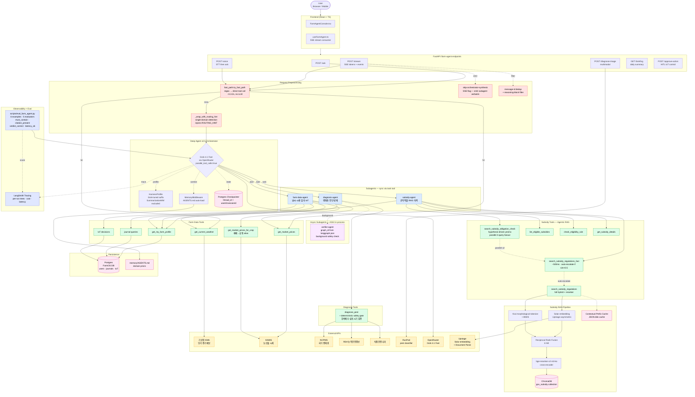

# FarmOS Farm Agent — Architecture

End-to-end view of the Deep Agent stack: request preprocessing, orchestrator,
subagents (sync + async), tools, RAG pipeline, external services, persistence,
and observability.

## How to render

- **GitHub / GitLab**: this file renders the Mermaid diagram automatically.
- **VS Code**: install the *Markdown Preview Mermaid Support* extension, then
  open this file with `Ctrl+Shift+V`.
- **PNG / SVG export**: paste the Mermaid block into [mermaid.live](https://mermaid.live)
  → *Actions* → *Download PNG* (or SVG).
- **Standalone HTML**: open `docs/agent-architecture.html` directly in a browser.

## Diagram



## Color legend

| Color | Meaning |
|---|---|
| 🟧 amber | External API (KMA, KAMIS, OpenRouter, Upstage, NCPMS, RDA, RunPod) |
| 🟦 blue | Synchronous subagent (delegated via Deep Agents `task` tool) |
| 🟪 purple | Async subagent (background ASGI, deepagents v0.5+) |
| 🟩 green | Tool — read-only data lookup or RAG retrieval |
| 🟧 pink | Persistence (Postgres, ChromaDB, file-based memory) |
| 🟦 indigo | Observability (LangSmith tracing, eval harness) |
| 🟥 red | Request-time preprocessing / streaming filter |

## Key flows

### A. Simple weather/price query (fast path, no LLM)
`User → /stream → fast_path.try_fast_path → tool → response (~0.3-2s)`

### B. Subsidy obligation question ("영농일지 꼭 써야 해?")
`User → /stream → fast_path miss → routing_hint(subsidy-agent) → orchestrator (1 tool_call) → task(subsidy-agent) → search_subsidy_obligation_check → parallel SRF×2 → verdict_hint → answer (~3-6s)`

### C. Pest diagnosis from image
`/diagnose-image → RunPod classifier → orchestrator → task(diagnosis-agent) → diagnose_pest (NCPMS+RDA+KMA) → safety gate → answer; verifier-agent runs async in background`

### D. Multi-topic decomposition ("자격 + 처벌")
`Orchestrator emits 2 tool_calls in one round → LangGraph parallel edges → 2× search_subsidy_regulations_fast concurrently → orchestrator synthesizes (~4-8s vs serial ~8-14s)`

## Optimization layers (recent)

1. **Fast-path** — regex shortcut for the top ~5 query patterns (weather, price, journal, IoT history) bypasses the LLM entirely.
2. **Direct routing hint** — single-domain queries (clear "직불금" / "병해충" keyword) skip the orchestrator's routing-decision LLM call.
3. **Parallel tool calls** — `parallel_tool_calls=True` lets the LLM emit multiple `task` / `search` calls in one round; LangGraph runs them on parallel edges.
4. **Auto-escalation** — `search_subsidy_regulations_fast` automatically retries with the full reranker if `top_sim < 0.5`. Deterministic, not prompt-dependent.
5. **Skip orchestrator synthesis** — after `task` returns, SSE emits the subagent's verbatim answer; the orchestrator's redundant paraphrasing is suppressed.
6. **Reasoning OFF default** — Grok reasoning ON multiplied per-call latency by 5×; off by default, opt-in via env.
7. **Hypothesis-driven yes/no** — `search_subsidy_obligation_check` fans out two queries (mandatory + optional hypotheses) and compares similarity to derive a verdict_hint deterministically.
8. **Async verifier** — verifier-agent runs in background ASGI; user sees diagnosis immediately while safety cross-check completes.
9. **Message dedup + reasoning-block filter** — eliminates duplicate response bubbles caused by Grok's reasoning content blocks.
10. **HarnessProfile (Grok)** — Grok-tuned system suffix and `SummarizationMiddleware` exclusion to prevent citation truncation on long contexts.

## ReasoningBank failure-mining pipeline

Two parallel queues, one shared toolchain. Both feed proposals into separate
human-review files; **nothing is auto-merged into agent runtime memory**.

### Strategy queue (offline, eval-driven)

```
eval_farm_agent.py            STRATEGY_CANDIDATES.md     STRATEGY_PROPOSALS.md
   │ (failed scores)             │ (## ⏳ ts — tags)         │ (## R-prop. ...)
   ▼                              ▼                              ▼
 _append_strategy_candidate ─► distill_strategies.py ──► reviewer copies
                                  │                          to STRATEGIES.md
                                  └─ --analyze: histogram
```

### Diagnosis queue (runtime, verifier-driven)

```
verifier-agent (FAIL/UNKNOWN)  DIAGNOSIS_CANDIDATES.md   DIAGNOSIS_PROPOSALS.md
   │ (PASS/FAIL/UNKNOWN)          │ (## ⏳ ts — tags)         │ (## D-prop. ...)
   ▼                              ▼                              ▼
 record_verifier_verdict ────► distill_strategies.py    reviewer files code
   (SSE delegation hook)         --diagnosis             change for tools/
                                  │                          routing/prompt
                                  └─ --analyze-diagnosis:
                                     verdict + question
                                     histogram
```

### Operator commands

```bash
cd backend

# Snapshot the strategy queue (post-eval failures)
.venv/Scripts/python scripts/distill_strategies.py --analyze

# Snapshot the diagnosis queue (verifier disagreements)
.venv/Scripts/python scripts/distill_strategies.py --analyze-diagnosis

# Generate strategy proposals (LLM call) — review before promoting to STRATEGIES.md
.venv/Scripts/python scripts/distill_strategies.py

# Generate diagnosis proposals (LLM call) — file as code-change reviews
.venv/Scripts/python scripts/distill_strategies.py --diagnosis

# Offline stub mode (no LLM, useful in CI / smoke tests)
.venv/Scripts/python scripts/distill_strategies.py --dry-run
.venv/Scripts/python scripts/distill_strategies.py --diagnosis --dry-run
```

### Schema distinctions

| Queue | Stub heading | Fields | Reviewer action |
|---|---|---|---|
| Strategy (`R-prop.`) | `## R-prop.` | `When` / `Strategy` / `Pitfall` | Edit `STRATEGIES.md`, loaded into every LLM call |
| Diagnosis (`D-prop.`) | `## D-prop.` | `When` / `Fix` / `Pitfall` | File code change to a tool / routing / verifier prompt |

### Pinned contracts (CI-enforced)

The regression suite (`scripts/test_distill_loop.py`, 48 cases) pins:

- **Verifier output format** — `VERIFIER_PROMPT` must mandate exactly `PASS|FAIL|UNKNOWN` as the leading verdict token; the `verifier_candidates.parse_verdict` regex must accept exactly those three.
- **Fast-path safety** — `BLOCKLIST` regex must continue to block 농약 / 진단 / 직불 / 보조금 / 시행지침 query patterns.
- **Verdict calibration** — `SUBSIDY_PROMPT` must contain the `UNCLEAR` rule + 담당 권장 phrasing + ⚠ marker.
- **Briefing sanitizer** — meta-reasoning preamble removal before any Korean morning brief renders.
- **Eval JSON summary schema** — `--summary-json` v1 fields stable for CI gating via `jq`.

CI gate: [`.github/workflows/farm-agent-tests.yml`](../.github/workflows/farm-agent-tests.yml). Live eval (gated, manual-dispatch only): [`.github/workflows/farm-agent-eval.yml`](../.github/workflows/farm-agent-eval.yml).

## File map

| Concern | Files |
|---|---|
| API endpoints | [backend/app/api/farm_agent.py](../backend/app/api/farm_agent.py) |
| Agent build + LLM + profiles | [backend/app/services/farm_agent/agent.py](../backend/app/services/farm_agent/agent.py) |
| Tools | [backend/app/services/farm_agent/tools.py](../backend/app/services/farm_agent/tools.py) |
| Prompts | [backend/app/services/farm_agent/prompts.py](../backend/app/services/farm_agent/prompts.py) |
| Fast path | [backend/app/services/farm_agent/fast_path.py](../backend/app/services/farm_agent/fast_path.py) |
| Subsidy RAG | [backend/app/services/subsidy/gov_rag.py](../backend/app/services/subsidy/gov_rag.py) |
| Async verifier graph | [backend/app/services/farm_agent/verifier_graph.py](../backend/app/services/farm_agent/verifier_graph.py) |
| Verifier candidate writer (iter 19) | [backend/app/services/farm_agent/verifier_candidates.py](../backend/app/services/farm_agent/verifier_candidates.py) |
| LangGraph manifest | [backend/langgraph.json](../backend/langgraph.json) |
| Eval harness | [backend/scripts/eval_farm_agent.py](../backend/scripts/eval_farm_agent.py) |
| Distill + analyze (both queues) | [backend/scripts/distill_strategies.py](../backend/scripts/distill_strategies.py) |
| Regression suite (48 cases) | [backend/scripts/test_distill_loop.py](../backend/scripts/test_distill_loop.py) |
| ReasoningBank ledger | [docs/ralph-agent-upgrade.md](ralph-agent-upgrade.md) |
| Frontend hook | [frontend/src/hooks/useFarmAgent.ts](../frontend/src/hooks/useFarmAgent.ts) |
| Frontend UI | [frontend/src/components/agent/FarmAgentConsole.tsx](../frontend/src/components/agent/FarmAgentConsole.tsx) |
